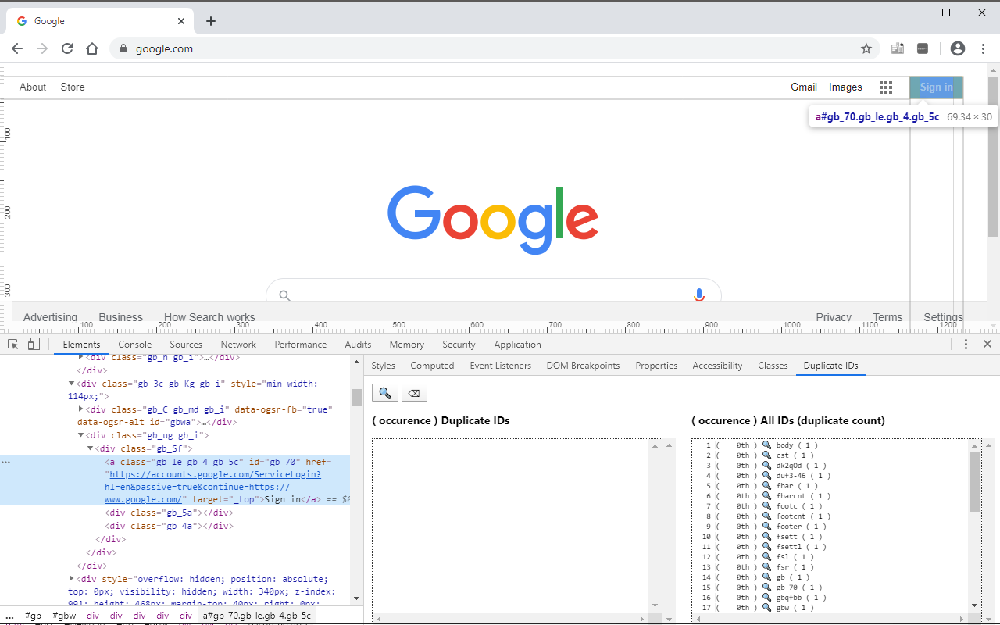

# dupid

## Chrome Web Store URL

[dupid](https://chrome.google.com/webstore/detail/dupid/padangffopopehnkjkcfnmcnblijlfbn)

Chrome Devtools Elements side panel to show duplicate IDs. Clicking on the 🔍 selects the element in the Elements tab. Hovering over the 🔍 highlights the element in the page with red glow border.

## Icon

